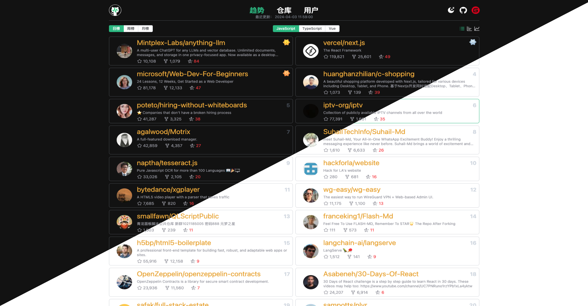
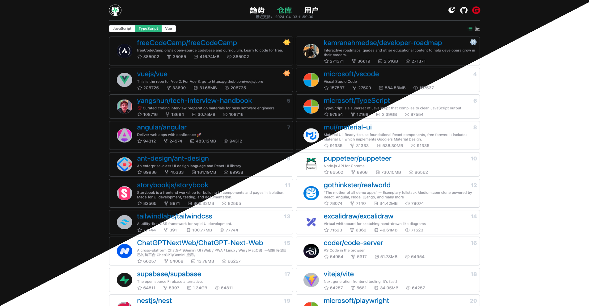
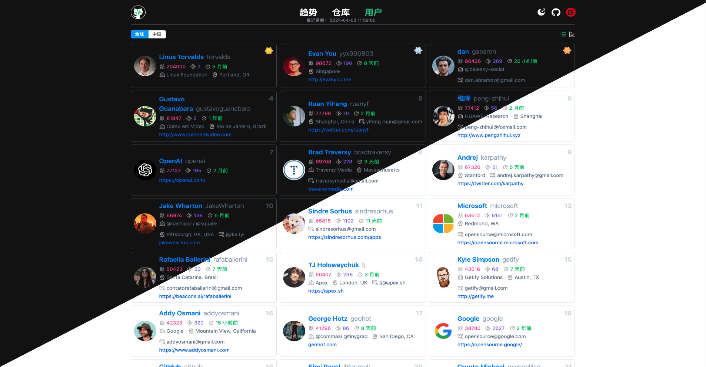

# Nuxt3网站模版

## 技术栈

1. Vue3
2. Nuxt3
3. UnoCss

## 效果展示

---

---

---


---


---


## 安装依赖

```bash
# pnpm
pnpm install
```

## 项目启动

启动在 `http://localhost: 8888`

```bash
pnpm dev
```

## 打包构建

```bash
pnpm  build
```

## 项目预览
```bash
pnpm preview
```
